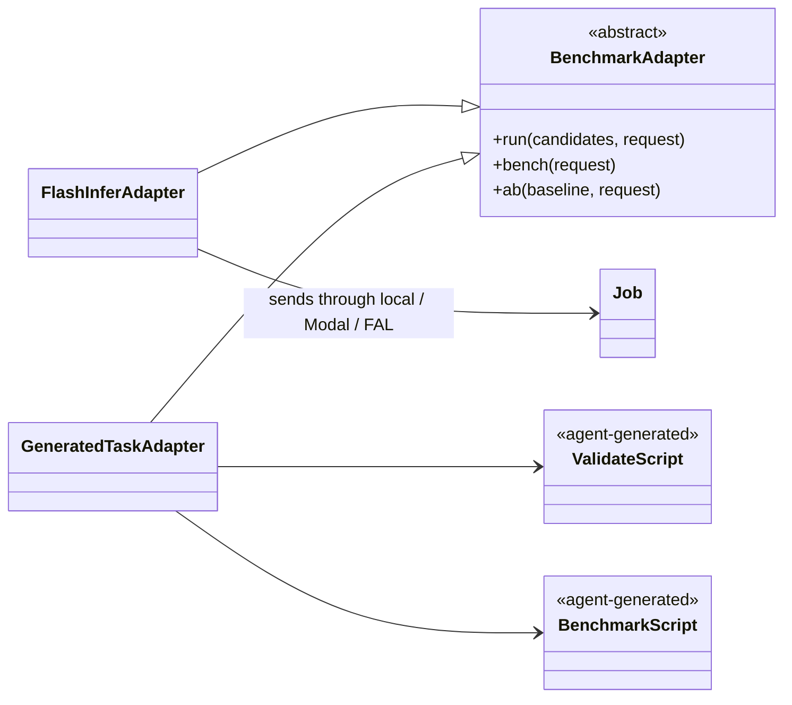

# kbench

Kbench separates benchmark adapters (what to run) from execution backends (where to
run it). FlashInfer is the built-in adapter and arbitrary repositories use an adapter
backed by the agent-generated `validate.py` and `benchmark.py` scripts.

