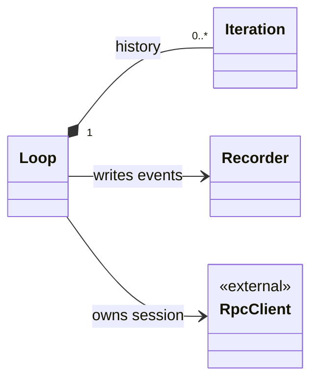

# kopt

Kopt scaffolds optimization projects and supervises repeated OMP turns. Its classes
use composition rather than inheritance: a loop owns its iteration history, agent
session, and append-only recorder.

